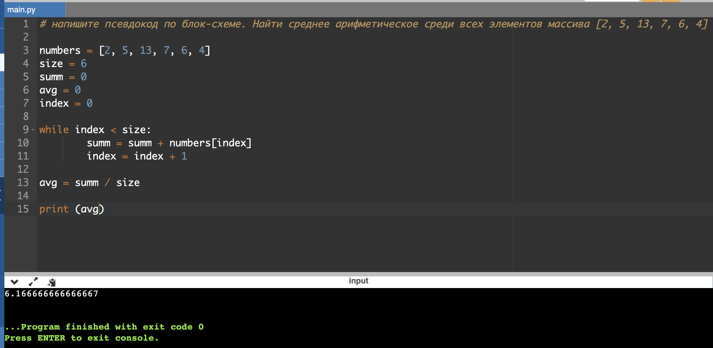

# Инструкция для работы с Markdown

## Выделение текста

Чтобы выделить текст курсивом, необходимо обрамить его звездочками (*) или знаком нижнего подчеркивания (_). Например, *Вот так* или _Вот так_.

Чтобы выделить текст полужирным, необходимо обрамить его двойнымии звездочками (**) или двойным знаком нижнего подчеркивания (__). Например, **Вот так** или __Вот так__.

Альтернативные способы выделения жирным или курсивом нужны для того, чтобы мы могли совмещать оба эти способа.
Например, _текст может быть выделен курсивом и при этом быть **полужирным**_.

## Списки

Чтобы добавить ненумерованные списки, необходимо пынкты выделить звездочкой (*). Например, вот так:
* Элемент 1
* Элемент 2
* Элемент 3

Чтобы добавить нумерованные списки, необходимо пункты просто пронумеровать. Например, вот так:
1. Первый пункт
2. Второй пункт

## Работа с изображениями

Чтобы вставить изображения в текст, достаточно написать следующее:

## Ссылки

## Таблицы

## Цитаты

## Заключение
